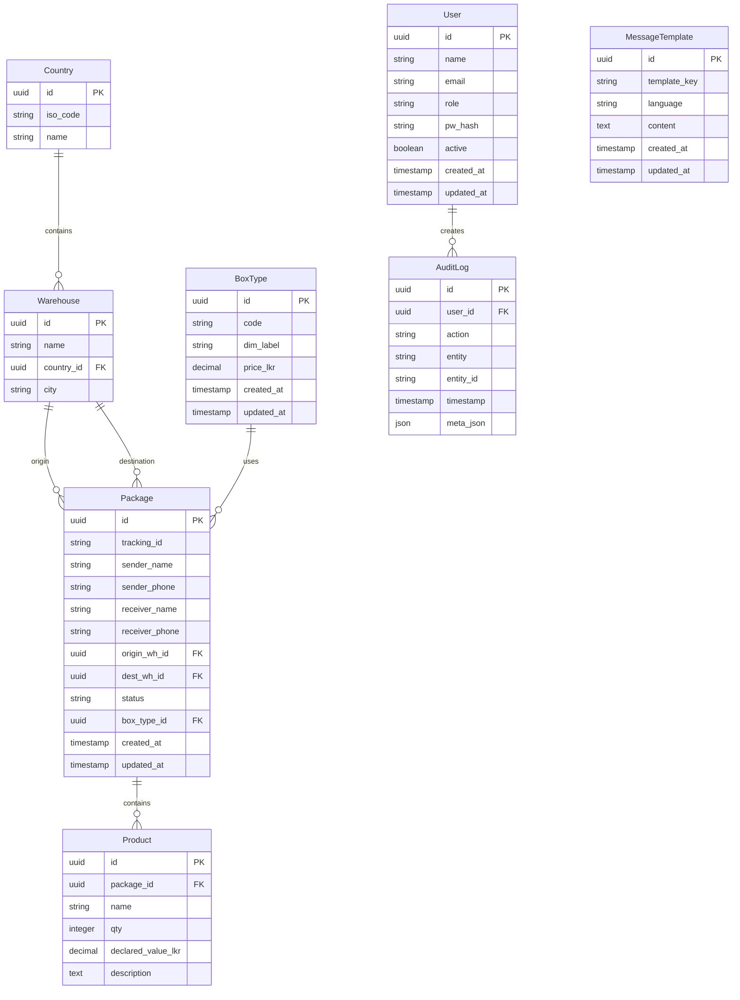

# Cargo SMS Alert System v3

🚀 **Production-ready web application for automated multilingual SMS alerts at every package tracking stage**

## Overview

This system automatically sends SMS alerts in English, Sinhala, and Tamil to both senders and receivers at key package-tracking stages (registration, in-transit updates, final delivery). Built for security, extensibility across multiple warehouses/countries, with comprehensive documentation.

## Tech Stack

- **Backend**: Python 3.12, FastAPI, SQLAlchemy ORM
- **Database**: PostgreSQL 16 (Docker)
- **Migrations**: Alembic
- **Frontend**: Jinja2 + Tailwind CSS (lightweight internal web UI)
- **SMS**: Infobip SMS API (abstracted behind service class)
- **Auth**: JWT + Role-based access ("Admin", "Staff", "Viewer")
- **Security**: Argon2 password hashing, rate limiting, vulnerability scans
- **Development**: Docker Compose, pre-commit hooks (Black, Ruff)
- **Testing**: pytest with ≥90% coverage target
- **CI/CD**: GitHub Actions with Bandit + Safety security scans

## Data Model (ERD)



## Core Features

1. **Package Registration API & Form** - Generate unique tracking_id, choose BoxType, attach products
2. **Real-Time Status Updates** - PATCH endpoint + internal UI; triggers SMS alerts
3. **Automated SMS Alerts** - Multilingual message templates (English/Sinhala/Tamil)
4. **Admin Panel** - CRUD for BoxTypes, Warehouses, Countries; pricing management
5. **Reporting** - CSV/PDF export for packages, pricing history, warehouse stats
6. **Security** - Argon2 hashing, JWT refresh tokens, rate limiting, vulnerability scans
7. **Audit Logs** - Complete write operation tracking
8. **Multilingual Support** - Language selection per sender/receiver with English fallback

## Quick Start

### Prerequisites
- Docker & Docker Compose
- Python 3.12+ (for local development)

### Development Setup

```bash
# Clone and setup
git clone <repo-url>
cd cargo-sms-alert-system

# Start services
docker compose up -d

# Run migrations
docker compose exec app alembic upgrade head

# Access the application
# API Documentation: http://localhost:8000/docs
# Admin UI: http://localhost:8000/admin
```

### Environment Variables

Create `.env` file in project root:

```env
# Database
DATABASE_URL=postgresql://postgres:postgres@db:5432/cargo_sms
TEST_DATABASE_URL=postgresql://postgres:postgres@db:5432/cargo_sms_test

# JWT
SECRET_KEY=your-secret-key-here
ACCESS_TOKEN_EXPIRE_MINUTES=30
REFRESH_TOKEN_EXPIRE_DAYS=7

# SMS (Infobip)
INFOBIP_API_KEY=your-infobip-api-key
INFOBIP_BASE_URL=https://api.infobip.com

# Security
BCRYPT_ROUNDS=12
RATE_LIMIT_PER_MINUTE=60

# Environment
ENVIRONMENT=development
DEBUG=true
```

## Project Structure

```
/
├── app/
│   ├── main.py              # FastAPI entry point
│   ├── api/
│   │   ├── routes/          # API route handlers
│   │   │   ├── auth.py
│   │   │   ├── packages.py
│   │   │   ├── admin.py
│   │   │   └── reports.py
│   │   └── deps.py          # Dependencies & middleware
│   ├── core/
│   │   ├── config.py        # Configuration management
│   │   ├── security.py      # JWT, password hashing
│   │   └── sms_service.py   # Infobip SMS integration
│   ├── models/              # SQLAlchemy ORM models
│   │   ├── user.py
│   │   ├── package.py
│   │   ├── warehouse.py
│   │   └── audit.py
│   ├── schemas/             # Pydantic models
│   │   ├── user.py
│   │   ├── package.py
│   │   └── common.py
│   ├── services/            # Business logic
│   │   ├── package_service.py
│   │   ├── sms_service.py
│   │   └── audit_service.py
│   ├── templates/           # Jinja2 templates
│   │   ├── base.html
│   │   ├── admin/
│   │   └── auth/
│   └── static/              # CSS, JS, images
│       ├── css/
│       └── js/
├── tests/
│   ├── conftest.py
│   ├── test_api/
│   ├── test_services/
│   └── test_models/
├── docker/
│   ├── Dockerfile
│   └── docker-compose.yml
├── alembic/                 # Database migrations
├── .github/
│   └── workflows/
│       └── ci.yml
├── docs/
│   ├── technical-manual.md
│   ├── user-manual.md
│   └── deployment-guide.md
├── pyproject.toml           # Poetry dependencies
├── .env.example
├── .gitignore
├── .pre-commit-config.yaml
└── Makefile                 # Development commands
```

## Development Commands

```bash
# Quality assurance (run before commits)
make qa

# Individual commands
make test          # Run tests
make lint          # Run linting
make format        # Format code
make security      # Security scans
make migrate       # Run migrations
make seed          # Seed test data
```

## API Endpoints

### Authentication
- `POST /auth/login` - User login
- `POST /auth/refresh` - Refresh JWT token
- `POST /auth/logout` - User logout

### Packages
- `POST /packages/` - Register new package
- `GET /packages/{tracking_id}` - Get package details
- `PATCH /packages/{tracking_id}/status` - Update package status
- `GET /packages/` - List packages (with filters)

### Admin
- `GET /admin/boxtypes` - List box types
- `POST /admin/boxtypes` - Create box type
- `PUT /admin/boxtypes/{id}` - Update box type
- `DELETE /admin/boxtypes/{id}` - Delete box type
- `GET /admin/warehouses` - List warehouses
- `POST /admin/warehouses` - Create warehouse

### Reports
- `GET /reports/packages.csv` - Package report (CSV)
- `GET /reports/pricing.pdf` - Pricing history (PDF)
- `GET /reports/warehouse-stats` - Warehouse statistics

## Testing

```bash
# Run all tests
pytest

# Run with coverage
pytest --cov=app --cov-report=html

# Run specific test file
pytest tests/test_api/test_packages.py

# Run with verbose output
pytest -v
```

## Security Features

- **Password Security**: Argon2 hashing with 12+ character minimum
- **JWT Tokens**: Access + refresh token rotation
- **Rate Limiting**: Configurable per-endpoint limits
- **Input Validation**: Comprehensive Pydantic schemas
- **SQL Injection Protection**: SQLAlchemy ORM parameterized queries
- **CORS Configuration**: Restricted origins in production
- **Security Headers**: Comprehensive HTTP security headers
- **Vulnerability Scanning**: Automated Bandit + Safety checks

## Deployment

See [deployment-guide.md](docs/deployment-guide.md) for complete Ubuntu 22.04 VPS setup with Gunicorn + Nginx + Certbot TLS.

## Contributing

1. Fork the repository
2. Create feature branch: `git checkout -b feature/amazing-feature`
3. Make changes and add tests
4. Run quality checks: `make qa`
5. Commit changes: `git commit -m 'Add amazing feature'`
6. Push to branch: `git push origin feature/amazing-feature`
7. Open Pull Request

## License

This project is licensed under the MIT License - see the LICENSE file for details.

## Support

For support, email support@cargo-sms.com or create an issue in this repository.
